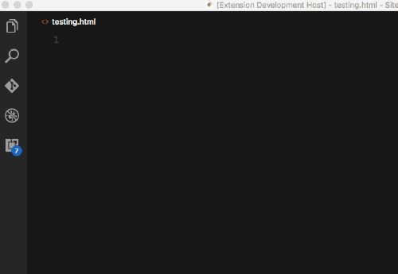

# Material 2 Snippets for Visual Studio Code
Material 2 Snippets for TypeScript and HTML in Visual Studio Code

HTML

Typescript

## Installation
Type `cmd-shift-p`/`ctrl-shift-p` to launch command palette and choose `Extensions: Install Extension`. Search for `Material 2 Snippets` and install.

## Usage
Type part of a snippet, press `enter` or `tab`

## Typescript Snippets
| Trigger                     | Description |
| -------                     | ----------- |
| `md2-imp-dialog`            | Import dialog component |
| `md2-imp-icon`              | Import icon component |
| `md2-imp-snackbar`          | Import snackbar component |

## HTML Snippets
| Trigger                   | Description |
| -------                   | ----------- |
| `md2-auto`                | Autocomplete component |
| `md2-btn`                 | Button component |
| `md2-btn-link`            | Button with routerLink component |
| `md2-raised-btn`          | Raised Button component |
| `md2-raised-btn-link`     | Raised Button with routerLink component |
| `md2-fab`                 | FAB component |
| `md2-fab-link`            | FAB with routerLink component |
| `md2-mini-fab`            | Mini FAB component |
| `md2-mini-fab-link`       | Mini FAB with routerLink component |
| `md2-btn-toggle`          | Button Toggle component |
| `md2-btn-toggle-grp`      | Button Toggle Group component |
| `md2-card`                | Card component |
| `md2-card-section`        | Card component with sections (header, content, actions) |
| `md2-checkbox`            | Checkbox component |
| `md2-chip`                | Chips component |
| `md2-grid`                | Grid list component |
| `md2-icon`                | Icon component |
| `md2-icon-svg`            | Icon with custom svg component |
| `md2-input`               | Input component |
| `md2-textarea`            | Textarea component |
| `md2-list`                | List component |
| `md2-menu`                | Menu component |
| `md2-menu-icon`           | Menu with icon component |
| `md2-prog-bar`            | Progress bar component |
| `md2-prog-circle`         | Progress circle component |
| `md2-spinner`             | spinner component |
| `md2-radio`               | Radio component |
| `md2-select`              | Select component |
| `md2-sidenav`             | Sidenav component |
| `md2-slider`              | Slider component |
| `md2-slide`               | Slide component |
| `md2-tab`                 | Tab component |
| `md2-toolbar`             | Toolbar component |
| `md2-toolbar-row`         | Toolbar with row component |
| `md2-tooltip`             | Tooltip component |